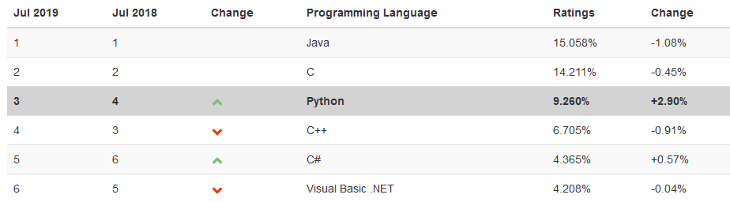

## Python fundamentals

__Python__ es un lenguaje de programación multiparadigma, ampliamente usando en la industria y en distintas áreas científica. Su sintaxis es bastante sencilla, lo cual hace que la curva de aprendizaje sea rápida. Es un lenguaje de propósito general por lo que puede usarse para resolver cualquier tipo de problema. Es uno de los lenguajes más populares actualmente según el ínidce de TIOBE.



Algunos ejemplos de áreas donde es usado este lenguaje son:

 - Aplicaciones web (Flask, Django)
 - Aplicaciones multiplataforma (PyQt, TCL, click)
 - Aplicaciones móviles (Kivy)
 - Electrónica, IOT (Micropython)
 - Data science (Tensorflow, Scipy)
 - Robótica (ROS)

### 1. Instalación
La instalación depende del sistema operativo que tengas. En este curso, usaremos versiones superiores a __Python__ 3.4, de lo contrario no podrás seguir algunos de los ejemplos.

#### Windows

- Descarga el instalador de la última versión de Python desde https://python.org, y sigue las instrucciones del instalador.

#### Linux

- Python 3 se encuentra disponible en la mayoría de distribuciones Linux. Sólo debes instalar la herramienta `pip`, que será utilizada más adelante, mediante el comando el consola (Debian y Ubuntu).

   ```bash
   sudo apt install python3-pip
   ```

#### Mac OS X

- Para Mac, la forma de instalación recomendada es mediante __Homebrew__, un gestor de paquetes para __Mac__. Sigue las instrucciones de instalación en https://brew.sh, y posteriormente ejecuta el comando: 

   ```bash
   brew install python3
   ```

Una vez que tengas instalado __Python__, revisa que se haya instalado correctamente mediante el comando:

```bash
$ python3 -V
Python 3.6.8
```

### 2. ¿Python 2 o Python 3?


Cuando __Python3__ salió al mundo, en 2008, tuvo una serie de cambios que lo hacían incompatible con código escrito de __Python2__, principalmente bibliotecas. Esto ocasinó que su nivel de adopción fuera bajo comparado con su antecesor. Sin embargo, con el paso de los años, esto ha ido cambiando.

Actualmente, se recomienda utilizar __Python3__ para todo nuevo proyecto. Este año, __Python2__ dejará de tener soporte, por lo tanto en proyectos desarrollados con __Python2__, se debe considerar contar con estrategias que permitan migrar a __Python3__.

### 3. ¡Hola Mundo!


En el libro *Programming in C*, los creadores de dicho de lenguaje de programación, explican que el program `Hello World`, es tan sencillo que debe ser el primero en escribirse en cualquier lenguaje de programación. A partir de entonces, millones de programadores en el mundo, usan esta convención al aprender un nuevo lenguaje.

Por supuesto, nosotros no serémos la excepción, así que, en la terminal de __Python__, teclea lo siguiente:

```python
>>> print("¡Hola Mundo!")
¡Hola Mundo!
```

También puedes colocarlo en un archivo, por ejemplo, nosotros lo hicimos dentro del archivo [`hola_mundo.py`](hola_mundo.py):

```python
print("¡HolaMundo!")
```

Nota la extensión del archivo. Para abrir ejecutar el archivo, desde una terminal (fuera de __Python__), ejecuta:

```bash
$ python hola_mundo.py
```

### 4. iPython

Una alternativa a la consola de __Python__ es __iPython__, una consola interactiva, con mas funcionalidades que la consola que trae tradicional. Para instalarla, debemos ejecutar el comando:

```bash
$ pip3 install ipython
Collecting ipython
[...]
Successfully installed ipython
```

E ingresamos a ella con el comando `ipython3`.

```python
$ ipython3
Python 3.6.8 (default, Jan 14 2019, 11:02:34) 
Type 'copyright', 'credits' or 'license' for more information
IPython 7.6.1 -- An enhanced Interactive Python. Type '?' for help.

In [1]: import this

The Zen of Python, by Tim Peters

Beautiful is better than ugly.
Explicit is better than implicit.
[...]
Namespaces are one honking great idea -- let's do more of those!

```

[Volver](../readme.md)
